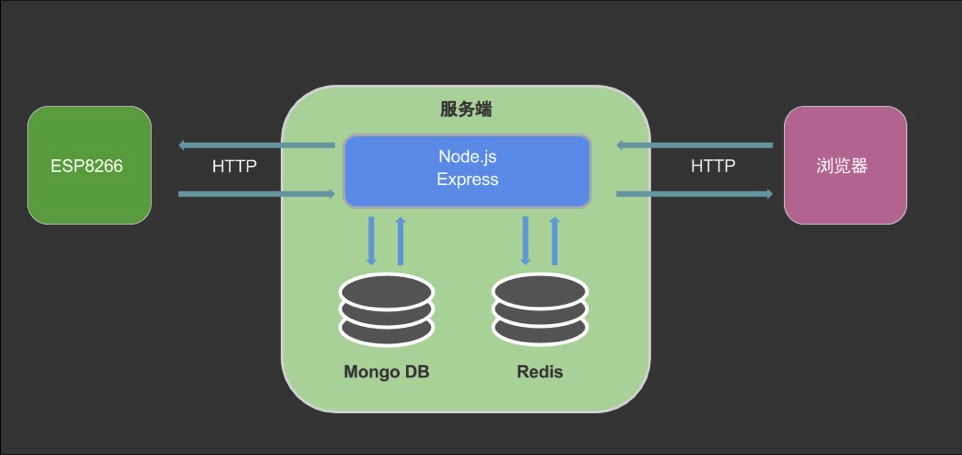
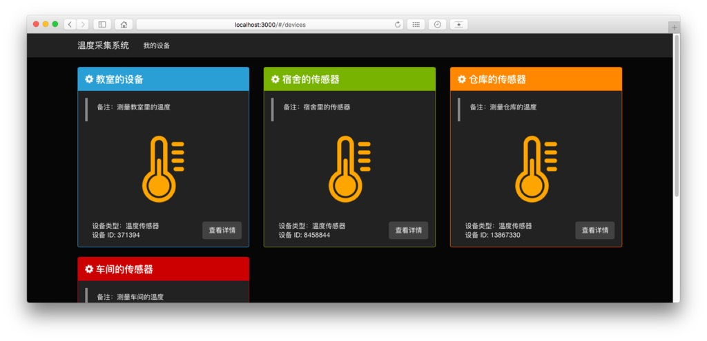
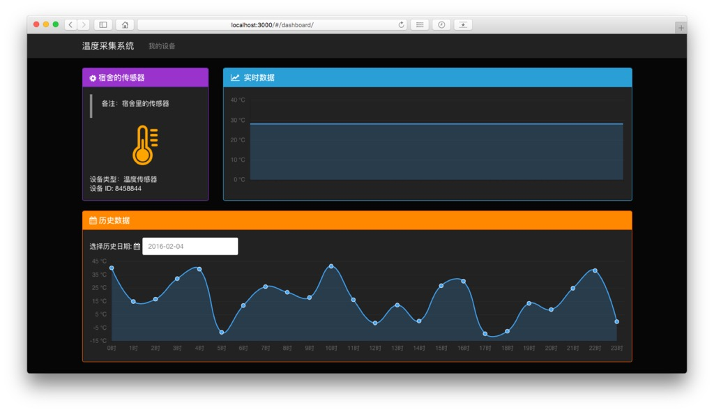

# myIot
  本人的毕业设计，实现一个基于物联网的温度采集系统。ESP8266 WIFI芯片采集温度信息，服务器端使用Node.js 的Express框架编程实现,浏览器端展示温度曲线，使用Angular Js框架实现。
## 系统概述
### 框图:

### 硬件端
温度信息采集主要使用 ESP8266 WIFI 芯片通过 DHT 22 传感器采集环境温 度信息,在指定的采集频率下将温度信息发往后台服务器。

### 服务器
后台服务器采用 Node.js 编程,使用Express框架，MongoDB和Redis数据库。为前端和温度信息采集部分提供 REST API 服务。服务器接收到温度采集部分传送过来的温度信息后,将温度信息储存到 数据库中,供浏览器端随时查看温度信息。

### 前端
前端使用 AngularJS ,Chart.js 图表库可视化温 度数据,Bootstrap 作为样式库并提供响应式布局。通过 HTTP 协议获取后台的温度数据绘制温度曲线。支持实时温度曲线和历史温度查看。

## 界面效果

